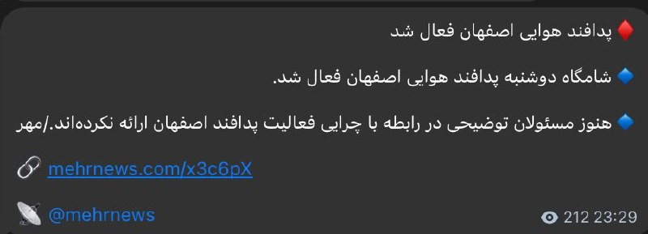

# خواننده تلگرام

<!-- TOP_NAV START -->

<!-- TOP_NAV END -->

<!-- MSG START -->

---
📅 بروزرسانی: 1405/02/29 00:12
---

## VahidOOnLine — post 240863

  

رسانه‌های ایران شامگاه دوشنبه از فعال شدن پدافند هوایی در اصفهان خبر دادند.

تا زمان انتشار این خبر توضیحی درباره علت فعال شدن پدافند ارائه نشده است.
پیش‌تر خبرگزاری تسنیم نوشت: «پس از مشاهده ریزپرنده‌ها در آسمان جزیره قشم، پدافند برای نابودی اهداف متخاصم فعال شد.»
‌🏁 🇬🇧 IranintlTV

🤖 @VahidOOnLine

## VahidOOnLine — post 240862

  

آنا کلی، معاون سخنگوی کاخ سفید، در گفت‌وگو با فاکس نیوز اعلام کرد که جمهوری اسلامی اجازه نخواهد داشت اورانیوم غنی‌شده در اختیار داشته باشد و این موضوع خط قرمز دونالد ترامپ در مذاکرات است.

او گفت: «تهران نه‌تنها نباید به سلاح هسته‌ای دست پیدا کند، بلکه باید مواد غنی‌شده را نیز تحویل دهد.»

کلی افزود که ترامپ معتقد است جمهوری اسلامی به‌خوبی می‌داند که او در تهدیدهایش بلوف نمی‌زند و عملیات‌های اخیر نشان داده واشینگتن در اجرای تهدیدات خود جدی است.
‌🏁 🇬🇧 IranintlTV

🤖 @VahidOOnLine

## VahidOOnLine — post 240861

  

♦️شبکه خبری آی۲۴نیوز گزارش داد بنیامین نتانیاهو، نخست‌وزیر اسرائیل، روز دوشنبه ۲۸ اردیبهشت، دومین جلسه محدود کابینه امنیتی خود را ظرف ۲۴ ساعت گذشته برگزار کرده است. مقامات اسرائیلی با اشاره به وضعیت «آماده‌باش کامل» اعلام کرده‌اند که کشور خود را برای تصمیم احتمالی رئیس‌جمهوری دونالد ترامپ درباره گام‌های بعدی در قبال تهران و احتمال ازسرگیری جنگ با ایران تا پایان هفته جاری آماده می‌کنند.
این نشست‌های فشرده پی‌درپی پس از گفتگوهای تلفنی ۳۰ دقیقه‌ای روز یکشنبه نتانیاهو و ترامپ صورت می‌گیرد. بر اساس گزارش منابع آگاه، ترامپ در این تماس نخست‌وزیر اسرائیل را در جریان جزئیات سفر اخیر خود به چین قرار داده، اما این گفتگو به راه‌حل مشخصی برای مسیر پیش‌رو منجر نشده است؛ با این حال، هماهنگی‌های فشرده میان اورشلیم و واشنگتن برای تمامی سناریوهای ممکن در آستانه آنچه مقامات آن را «لحظه حقیقت» می‌نامند، ادامه دارد.
‌🇸🇦 Indypersian

🤖 @VahidOOnLine

## WithYashar — post 11597

@withyashar part3

## mwarmonitor — post 9279

فعل شدن پدافند هوایی در اصفهان

## FoxNewsTwitter — post 341898

  <a href="telegram/content/FoxNewsTwitter_341898_1779136933.mp4" target="_blank">🎬 Download video</a>

Fox News (Twitter/X)

NEW: U.S. Attorney Jeanine Pirro draws a hard line against teen lawlessness following a violent brawl at a DC Chipotle:

"It was a takeover of a restaurant by individuals who felt they could get away with it. Well, they're not going to get away with it."

"The message that lawlessness runs the streets is over."

"The city belongs to law-abiding residents, not roaming mobs looking to make a name for themselves, contribute to the chaos and violence, or gain social media attention."

"These are not kids being kids."

## pm_afshaa — post 90994

فعالیت پدافند در اصفهان

💧 Rainbet.com the #1 Non-KYC Crypto Casino & Sportsbook @rainbetcom

😁 @Pm_Afshaa

## kianmeli1 — post 87474

🔴پدافند هوایی اصفهان شامگاه دوشنبه فعال شد و علت آن هنوز اعلام نشده است.
https://t.me/kianmeli1

## IranIntlTV — post 337837

  

رسانه‌های ایران شامگاه دوشنبه از فعال شدن پدافند هوایی در اصفهان خبر دادند.

تا زمان انتشار این خبر توضیحی درباره علت فعال شدن پدافند ارائه نشده است.
پیش‌تر خبرگزاری تسنیم نوشت: «پس از مشاهده ریزپرنده‌ها در آسمان جزیره قشم، پدافند برای نابودی اهداف متخاصم فعال شد.»
https://iranintl.com/202605188482

## IranIntlTV — post 337836

  <a href="telegram/content/IranIntlTV_337836_1779136935.mp4" target="_blank">🎬 Download video</a>

مستند «تمرین‌هایی برای یک انقلاب» ساخته پگاه آهنگرانی در حاشیه جشنواره فیلم کن، جایزه ویژه هیات داوران رویداد مستند گلدن گلوبز را دریافت کرد.

این رویداد با همکاری بخش کن داکس، مجله ورایتی و بازار فیلم کن برگزار می‌شود.

گفت‌وگو با محمد عبدی، نویسنده و منتقد فیلم
@iranintltv

## IranIntlTV — post 337835

  

آنا کلی، معاون سخنگوی کاخ سفید، در گفت‌وگو با فاکس نیوز اعلام کرد که جمهوری اسلامی اجازه نخواهد داشت اورانیوم غنی‌شده در اختیار داشته باشد و این موضوع خط قرمز دونالد ترامپ در مذاکرات است.

او گفت: «تهران نه‌تنها نباید به سلاح هسته‌ای دست پیدا کند، بلکه باید مواد غنی‌شده را نیز تحویل دهد.»

کلی افزود که ترامپ معتقد است جمهوری اسلامی به‌خوبی می‌داند که او در تهدیدهایش بلوف نمی‌زند و عملیات‌های اخیر نشان داده واشینگتن در اجرای تهدیدات خود جدی است.
https://iranintl.com/202605188107

## Shin_Persian — post 6078

  

Shin ✓ @hey_itsmyturn
Mon, 18 May 2026 20:34:12 UTC

MehrNews confirms

فارسی

خبرگزاری مهر تأیید کرد

𝕏 · @shin_persian

## FarsiVOA — post 218092

  

⚡️یک دادگاه تحت کنترل شورشیان حوثی در یمن ۱۹ نفر را به اتهام همکاری با ائتلاف تحت رهبری عربستان به اعدام محکوم کرد. حوثی‌ها مورد حمایت جمهوری اسلامی هستند و ائتلاف تحت رهبری عربستان در حمایت از دولت قانونی یمن با حوثی‌ها در جنگ بود. به گزارش آسوشیتدپرس این حکم روز یکشنبه صادر شد.
@FarsiVOA

## Persian_Trend_Official — post 14458

  

فعال شدن پدافند هوایی اصفهان/مهر نیوز

☆Phantom☆

📌 @persian_trend_official
پرشین ترند | متفاوت‌ترین کانال نظامی

## RadioFarda — post 157323

  <a href="https://t.me/radiofarda/157323" target="_blank">📎 Download file</a>

📻بشنوید: سرخط خبرهای بامدادی رادیوفردا، ۲۹ اردیبهشت ۱۴۰۵‌

@RadioFarda

## IranianMinds — post 20366

🔴خبرگزاری مهر:

پدافند هوایی در اصفهان فعال شد.

@IranianMinds

## IranianMinds — post 20365

🔴 ترامپ:

هم‌اکنون مذاکرات جدی برای رسیدن به توافق با ایران در جریان است.

@IranianMinds

## alonews — post 120968

  <a href="telegram/content/alonews_120968_1779136939.webm" target="_blank">🎬 Download video</a>

👈سخنگوی وزارت خارجه آمریکا در گفتگو با الجزیره: ترامپ برای رسیدن به توافقی غیرقابل قبول عجله نخواهد کرد

🔴خطوط قرمز رئیس‌جمهور روشن است و آن اینکه ایران نباید به سلاح هسته‌ای دست یابد.

✅ @AloNews خبر جنگ

## alonews — post 120967

  <a href="telegram/content/alonews_120967_1779136939.webm" target="_blank">🎬 Download video</a>

👈این وسط تو صدا و سیما تانک آوردن

✅ @AloNews خبر جنگ

## alonews — post 120966

  <a href="telegram/content/alonews_120966_1779136939.webm" target="_blank">🎬 Download video</a>

👈صدا و سیما: دیدید ترامپ ترسید؟

✅ @AloNews خبر جنگ

---
📅 بروزرسانی: 1405/02/29 00:02
---

## WithYashar — post 11596

خبرنگار آکسیوس:ترامپ از زمان شروع جنگ حداقل 12 بار ضرب الاجل ها را تمدید کرده و حملات برنامه ریزی شده به ایران را به تعویق انداخته
@withyashar

## WithYashar — post 11595

ترامپ: مذاکرات جدی در حال حاضر برای دستیابی به توافق با ایران در جریان است.
@withyashar

## Shin_Persian — post 6077

Shin ✓ @hey_itsmyturn
Mon, 18 May 2026 20:31:15 UTC

AA activity in Isfahan right now
Isfahan Province, #Iran

فارسی

فعالیت پدافند هوایی همین الان در اصفهان
استان اصفهان، #Iran_

𝕏 · @shin_persian

## Persian_Trend_Official — post 14457

  

حزب‌الله : ما یک هواپیمای جنگی اسرائیلی را با یک موشک زمین به هوا در حریم هوایی بخش غربی جنوب لبنان رهگیری کردیم.

☆Phantom☆

📌 @persian_trend_official
پرشین ترند | متفاوت‌ترین کانال نظامی

## alonews — post 120965

  <a href="telegram/content/alonews_120965_1779136350.webm" target="_blank">🎬 Download video</a>

👈پدافند اصفهان فعال شد

✅ @AloNews خبر جنگ

<!-- MSG END -->

<!-- NAV START -->

<!-- NAV END -->
