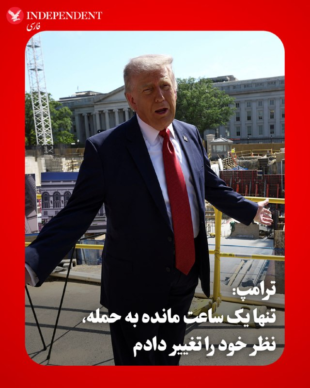
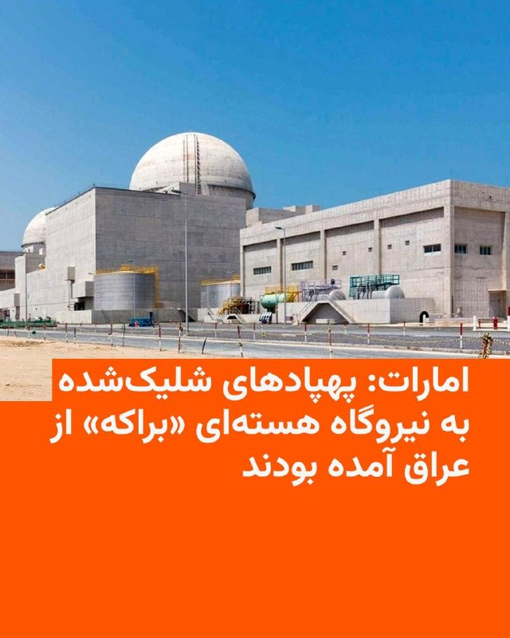

# خواننده تلگرام

<!-- TOP_NAV START -->

<a href="https://github.com/ProAlit/aio-downloader/blob/main/telegram/content/archive_1.md" style="display:inline-block; padding:6px 12px; margin:0 4px; background-color:#2ea44f; color:white; text-decoration:none; border-radius:4px; font-weight:bold;">صفحه بعد</a>

<!-- TOP_NAV END -->

<!-- MSG START -->

---
📅 بروزرسانی: 1405/02/29 19:53
---

## VahidOOnLine — post 240998

  

♦️ دونالد ترامپ، رئیس‌جمهوری آمریکا، روز سه‌شنبه ۲۹ اردیبهشت در جمع خبرنگاران در کاخ سفید افشا کرد که دستور یک حمله نظامی بزرگ علیه ایران را صادر کرده بود، اما تنها یک ساعت پیش از آغاز عملیات، تصمیم خود را تغییر داد و آن را لغو کرد.

ترامپ با اشاره به آماده‌باش کامل نیروهای نظامی برای این حمله گسترده، دلیل به تعویق انداختن این حمله را درخواست مستقیم رهبران کشورهای حوزه‌ خلیج فارس عنوان کرد. به گفته او، مقامات این کشورها در تماس‌هایی اضطراری از واشنگتن خواستند تا به دیپلماسی فرصت دوباره داده شود. رئیس‌جمهوری آمریکا تاکید کرد که در حال حاضر «مذاکراتی جدی» میان ایالات متحده و جمهوری اسلامی در جریان است و کشورهای منطقه معتقدند این گفتگوها می‌تواند به یک توافق صلح پایدار و مورد پذیرش همه طرف‌ها منجر شود.
‌🇸🇦 Indypersian

🤖 @VahidOOnLine

## VahidOOnLine — post 240997

  <a href="telegram/content/VahidOOnLine_240997_1779207782.mp4" target="_blank">🎬 Download video</a>

♦️ولادیمیر پوتین، رئیس‌جمهوری روسیه، سه‌شنبه ۲۹ اردیبهشت‌ماه،برای سفری دو روزه و گفتگو درباره مسائل مهم بین‌المللی وارد پکن شد و در فرودگاه مورد استقبال وانگ یی، وزیر خارجه چین، قرار گرفت.

بر اساس برنامه اعلام‌شده، پوتین و شی جین‌پینگ روز ۳۰ اردیبهشت ابتدا در نشستی محدود و سپس در دیداری با حضور هیئت‌های عالی‌رتبه دو کشور گفتگو خواهند کرد.

طبق اعلام مقام‌های روسیه و چین، هدف اصلی این سفر تقویت روابط دوجانبه و بررسی چالش‌های مهم جهانی عنوان شده است. همچنین قرار است دو رهبر عصر همان روز در دیداری غیررسمی، درباره مسائل بین‌المللی در فضایی دوستانه گفتگو کنند.
‌🇸🇦 Indypersian

🤖 @VahidOOnLine

## WithYashar — post 11678

  <a href="telegram/content/WithYashar_11678_1779207783.mp4" target="_blank">🎬 Download video</a>

ولادیمیر پوتین وارد چین شد؛ جایی که وانگ یی، وزیر امور خارجهٔ چین، از او استقبال کرد.
@withyashar

## pm_afshaa — post 91044

🔴ریکلین فاش خبرنگار اسرائیلی: نیروهای ویژه ارتش اسرائیل دارن برای نفوذ به تأسیسات هسته ایی اصفهان تمرین می‌کنن تا اورانیوم غنی‌شده رو خارج کنن
مواد هسته‌ای اون‌قدرا هم عمیق دفن نشده و بعد از ورود به سایت، میشه منتقلش کرد

💧 Rainbet.com the #1 Non-KYC Crypto Casino & Sportsbook @rainbetcom

😁 @Pm_Afshaa

## DEJradio — post 4748

  <a href="telegram/content/DEJradio_4748_1779207785.mp4" target="_blank">🎬 Download video</a>

🚨
🔸 سوشا مکانی، دروازه‌بان پیشین تیم ملی:
صدای رشید مظاهری باشیم؛ او فرزند رشید ایران است.

#رشید_مظاهری #فرزند_ایران
@DEJradio

## IranIntlTV — post 337957

  <a href="https://t.me/IranintlTV/337957" target="_blank">📎 Download file</a>

🎧نسخه صوتی اخبار شبانگاهی | سه‌شنبه ۲۹ اردیبهشت
@iranintlTV

## RadioFarda — post 157357

🔸امارات متحده عربی روز سه‌شنبه اعلام کرد پهپادهایی که دو روز پیش به سمت نیروگاه هسته‌ای این کشور شلیک شدند، از عراق آمده بودند. 🔸از زمان آغاز جنگ آمریکا و اسرائیل با ایران در نهم اسفند پارسال، گروه‌های مورد حمایت جمهوری اسلامی در عراق چندین حمله به کشورهای…

## RadioFarda — post 157356

  

🔸امارات متحده عربی روز سه‌شنبه اعلام کرد پهپادهایی که دو روز پیش به سمت نیروگاه هسته‌ای این کشور شلیک شدند، از عراق آمده بودند.

🔸از زمان آغاز جنگ آمریکا و اسرائیل با ایران در نهم اسفند پارسال، گروه‌های مورد حمایت جمهوری اسلامی در عراق چندین حمله به کشورهای دیگر ترتیب داده‌اند.

🔸وزارت دفاع امارات در بیانیه‌ای اعلام کرد: «در چارچوب تحقیقات جاری درباره حمله آشکار به نیروگاه هسته‌ای «براکه» در ۱۷ مه ۲۰۲۶، رهگیری و پایش فنی تأیید کرد که هر سه پهپاد همگی از خاک عراق منشأ گرفته‌اند.»

🔸این وزارتخانه افزود که مقام‌ها طی ۴۸ ساعت گذشته شش پهپاد دیگر را که از عراق آمده و «تلاش داشتند مناطق غیرنظامی و حیاتی را هدف قرار دهند» رهگیری کرده‌اند.

🔸یک پهپاد که مسئولیت شلیک آن بر عهده گرفته نشده، روز یکشنبه به یک ژنراتور برق در نزدیکی نیروگاه هسته‌ای براکه در ابوظبی برخورد کرد و باعث آتش‌سوزی شد، اما هیچ مصدوم یا نشت پرتوی به‌جا نگذاشت. دو پهپاد دیگر نیز رهگیری شدند.

@RadioFarda

## BBCPersian — post 281509

🔻امارات متحده عربی: پهپادهایی که هفته پیش نیروگاه هسته‌ای را هدف قرار دادند، از عراق آمده بودند

امارات متحده عربی روز سه‌شنبه اعلام کرد پهپادهایی که هفته پیش نیروگاه هسته‌ایش را هدف قرار دادند، از عراق آمده بودند.

در بیانیه وزارت دفاع امارات آمده است: «به عنوان بخشی از تحقیقات جاری در مورد حمله آشکار به نیروگاه هسته‌ای براکه در ۱۷ مه ۲۰۲۶، ردیابی و نظارت فنی تایید کرده است که این سه پهپاد... همگی از قلمرو عراق آمده‌اند.»

از زمان آغاز جنگ آمریکا و اسرائیل با ایران، گروه‌های تحت حمایت جمهوری اسلامی چندین حمله از عراق انجام داده‌اند.

امارات متحده روز یکشنبه گفت که در حمله پهپادی، ژانراتور برق بیرون محوطه نیروگاه هسته‌ای براکه، در نزدیکی ابوظبی، آتش گرفته است.

این کشور در بیانیه‌هایش نامی از کشوری نبرد و فقط گفت پهپاد از «مرز غربی» وارد شده بود.

سخنگوی وزارت خارجه ایران امروز اتهام صدراعظم آلمان را تکذیب کرد که گفته بود ایران در حمله به نزدیکی نیروگاه هسته‌ای امارات متحده عربی نقش داشته است.

## alonews — post 121142

  <a href="telegram/content/alonews_121142_1779207787.webm" target="_blank">🎬 Download video</a>

👈رابرت مالی رئیس هیات مذاکره کننده آمریکا در دوره بایدن: مدتهاست که زمان آن فرا رسیده که کاری را انجام دهیم که برای بسیاری از ما غیرممکن به نظر می‌رسد، و آن این است که به حرف‌های ترامپ اصلاً هیچ توجهی نکنیم.

🔴این بدان معنا نیست که او حمله نخواهد کرد؛ به این معنا نیست که حتماً حمله خواهد کرد.

🔴معنایش این است که حرفی که او یک روز می‌زند، هیچ نسبتی با واقعیت ندارد و هیچ نسبتی با حرفی که روز بعد خواهد زد، ندارد

✅ @AloNews خبر جنگ

<!-- MSG END -->

<!-- NAV START -->

<a href="https://github.com/ProAlit/aio-downloader/blob/main/telegram/content/archive_1.md" style="display:inline-block; padding:6px 12px; margin:0 4px; background-color:#2ea44f; color:white; text-decoration:none; border-radius:4px; font-weight:bold;">صفحه بعد</a>

<!-- NAV END -->
